# motion-anything

<p align="center"><sub><a href="https://github.com/nexu-io/open-design"><b>nexu.io · Open Design</b></a> 家族项目 —— 同一支团队对「动效」的回答。如果你喜欢 motion-anything，<a href="https://github.com/nexu-io/open-design">Open Design</a> 是这支团队规模化交付的 agent 时代设计工作室。</sub></p>

> **描述感觉，AI 交付动画。** agentic motion layer（智能体动效层）：本地优先、对话原生的动效引擎。一句话生成动效网页和 launch 视频，然后**在跑着的页面上逐组件编辑动效** —— 4 种触发、13 个动法、弹簧缓动、完整关键帧编辑器。**8 个编码 agent 引擎 + BYOK** 随便换（Claude Code · Codex · Cursor · OpenCode · Grok Build · Hermes · Gemini · Open Design Cloud），**403 个策展动效配方**弹药充足，产物随处可去：JSON · CSS · React · Lottie · MP4 · GIF · 可移植 skill。零 npm 依赖，无水印，无按次渲染收费。

<p align="center">
  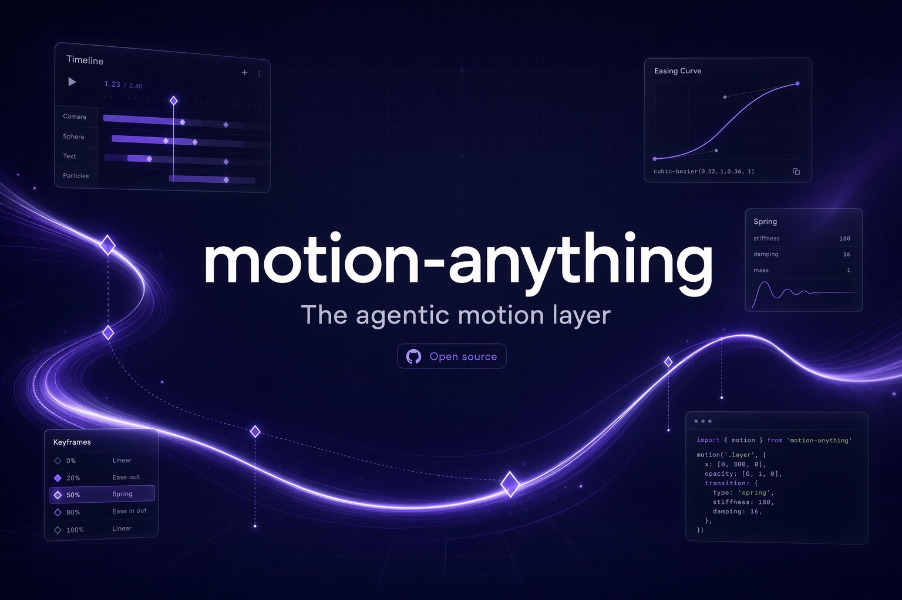
</p>

<p align="center">
  <a href="LICENSE"></a>
  <a href="#引擎"></a>
  <a href="#动效库"></a>
  <a href="#万物可导出"></a>
  <a href="#快速开始"></a>
</p>

<p align="center"><a href="README.md">English</a> · <b>简体中文</b></p>

---

## 效果一览

下面每一格都是库里**活的零依赖配方** —— 真 GPU 着色器、真 canvas 引擎，忠实移植后只需两个 `<script>` 标签就能跑在任何网页上（无 React、无 three.js、无构建）。点击进入配方文件夹，每个都带自包含的 `preview.html`。

<table>
<tr>
<td width="50%"><a href="recipes/web/lightning/">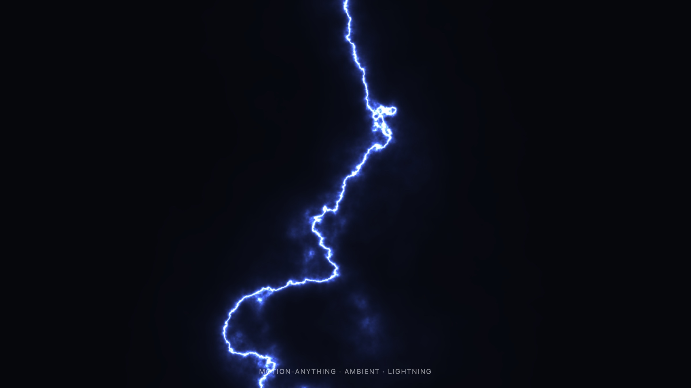</a></td>
<td width="50%"><a href="recipes/web/galaxy/">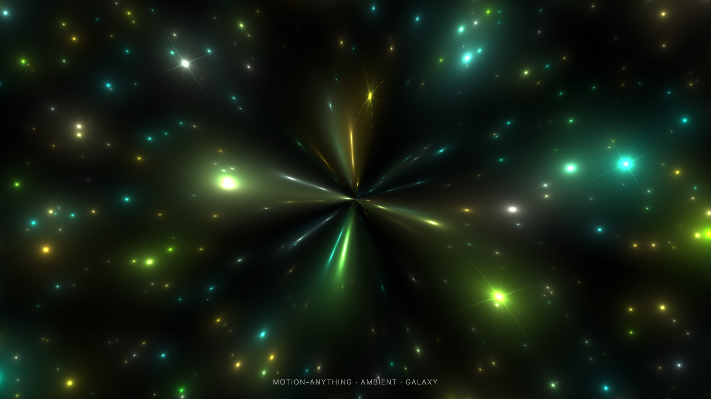</a></td>
</tr>
<tr>
<td><b><a href="recipes/web/lightning/">lightning</a></b> · GPU 着色器<br/><sub>一道带辉光的活闪电。原本要 raw WebGL + React；现在是一个 58 行运行器 + 一个文件。</sub></td>
<td><b><a href="recipes/web/galaxy/">galaxy</a></b> · GPU 着色器<br/><sub>漂移星河与镜头光斑 —— 营销级 hero 背景。</sub></td>
</tr>
<tr>
<td width="50%"><a href="recipes/web/silk/">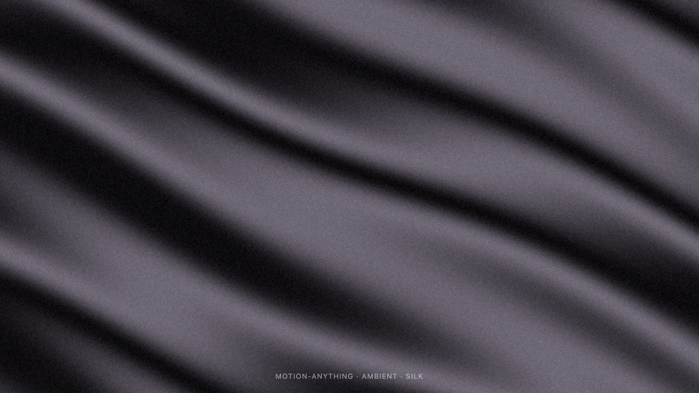</a></td>
<td width="50%"><a href="recipes/web/splash-cursor/">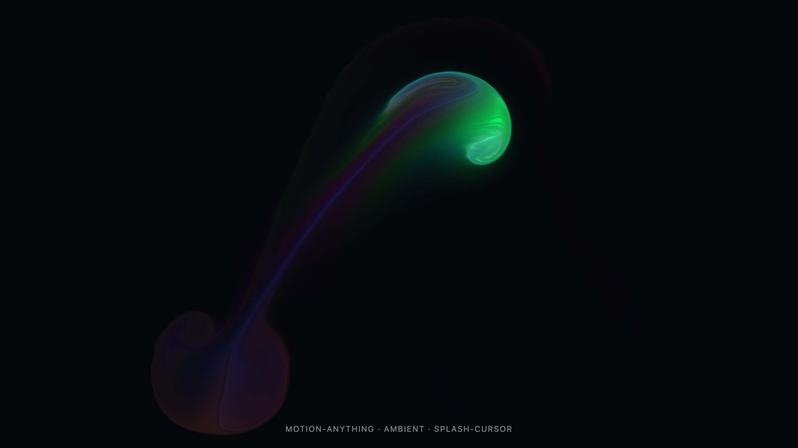</a></td>
</tr>
<tr>
<td><b><a href="recipes/web/silk/">silk</a></b> · GPU 着色器<br/><sub>流动的丝绸，从 three.js 场景移植成单个片段着色器。</sub></td>
<td><b><a href="recipes/web/splash-cursor/">splash-cursor</a></b> · 流体模拟<br/><sub>完整多 pass WebGL 流体模拟（curl · vorticity · pressure · advection），指针划过泼洒发光染料。</sub></td>
</tr>
<tr>
<td width="50%"><a href="recipes/web/waves/"></a></td>
<td width="50%"><a href="recipes/web/faulty-terminal/">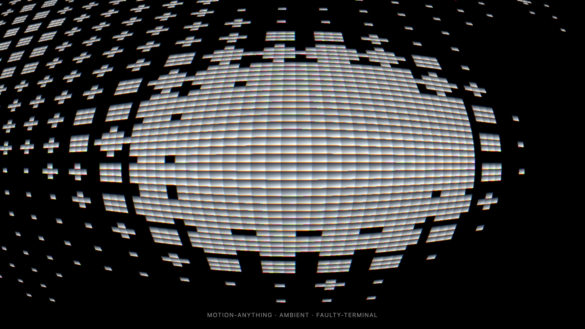</a></td>
</tr>
<tr>
<td><b><a href="recipes/web/waves/">waves</a></b> · canvas 2D<br/><sub>perlin 扭曲线场 + 指针尾迹 —— 有机、编辑部气质、安静。</sub></td>
<td><b><a href="recipes/web/faulty-terminal/">faulty-terminal</a></b> · GPU 着色器<br/><sub>故障 CRT 网格，赛博 / 开发者工具气质。</sub></td>
</tr>
<tr>
<td width="50%"><a href="recipes/web/aurora/">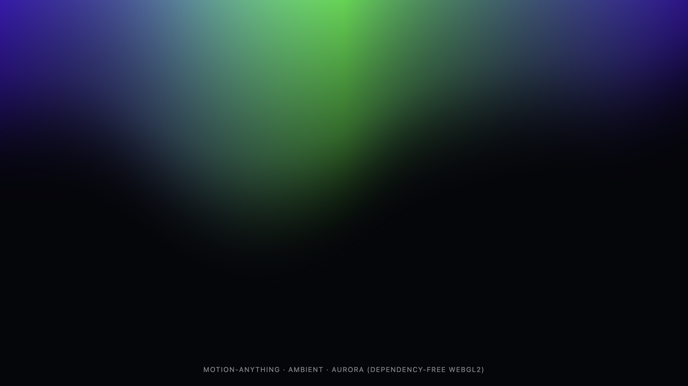</a></td>
<td width="50%"><a href="recipes/web/pixel-blast/">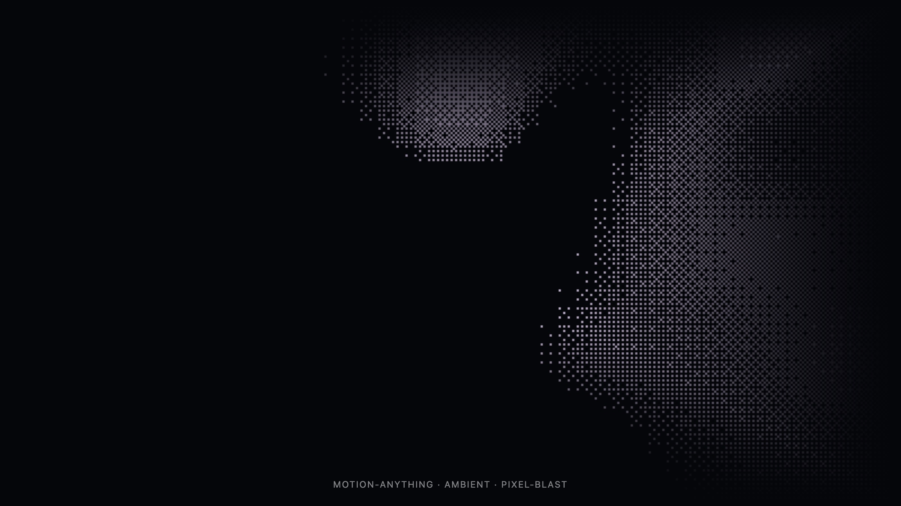</a></td>
</tr>
<tr>
<td><b><a href="recipes/web/aurora/">aurora</a></b> · GPU 着色器<br/><sub>暗色 hero 上扫过的极光 —— 经典，但做得克制。</sub></td>
<td><b><a href="recipes/web/pixel-blast/">pixel-blast</a></b> · GPU 着色器 · 可交互<br/><sub>漂移像素图案，每次点击荡开涟漪。</sub></td>
</tr>
</table>

<p align="center"><sub>35 个特别效果为忠实零依赖移植 —— 来源与授权见 <a href="ATTRIBUTION.md">ATTRIBUTION.md</a>。完整库共 <b>403 个配方</b>。</sub></p>

---

## 产品导览

<table>
<tr>
<td valign="top">
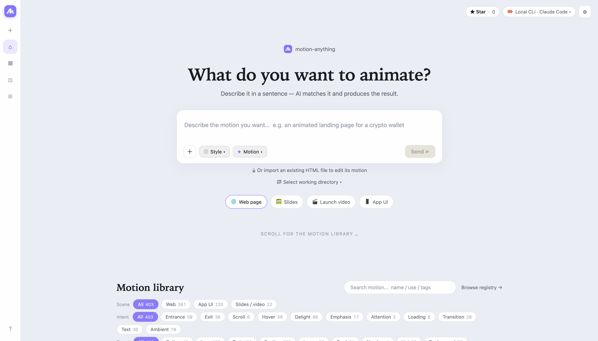<br/>
<sub><b>首页</b> —— 一句话进，动效产物出。可选设计系统（59 套品牌包）和动效配置（Subtle → Cinematic），也可以直接开打。</sub>
</td>
</tr>
</table>

<table>
<tr>
<td width="50%" valign="top">
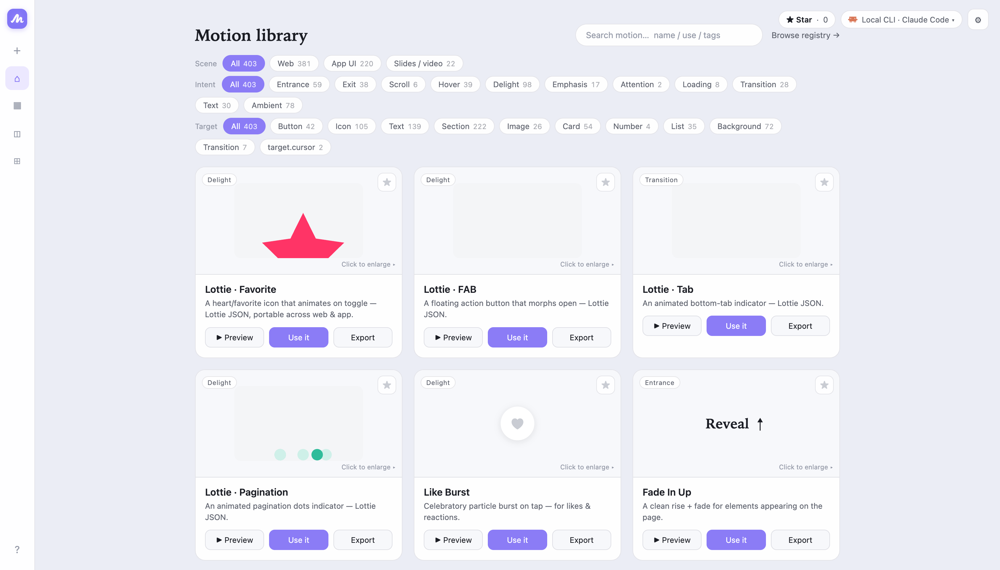<br/>
<sub><b>工作台</b> —— 产品的心脏。在<i>跑着的</i>页面上点选任意组件给它动效：4 种触发（加载/滚动/悬停/点击）、13 个动法、弹簧缓动、6 轨关键帧编辑器（scrub + 自动打点）。或者选中组件直接对它说话。</sub>
</td>
<td width="50%" valign="top">
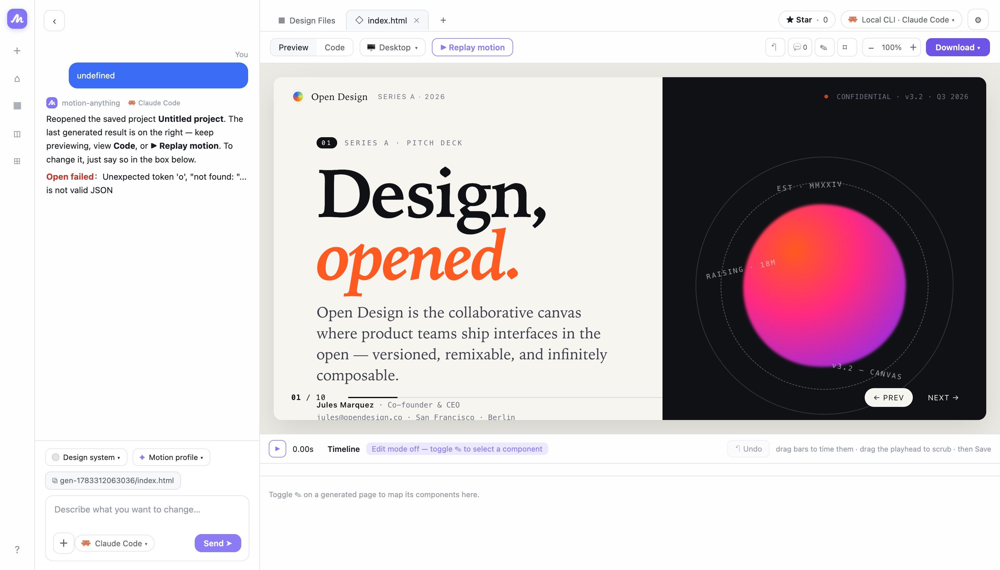<br/>
<sub><b>视频编辑器</b> —— launch 视频的画布合成器：多镜头真转场、逐图层关键帧轨、kinetic typography（13 个逐字/逐词预设）、浏览器内 WebCodecs 导出 MP4。无水印，不上传。</sub>
</td>
</tr>
<tr>
<td width="50%" valign="top">
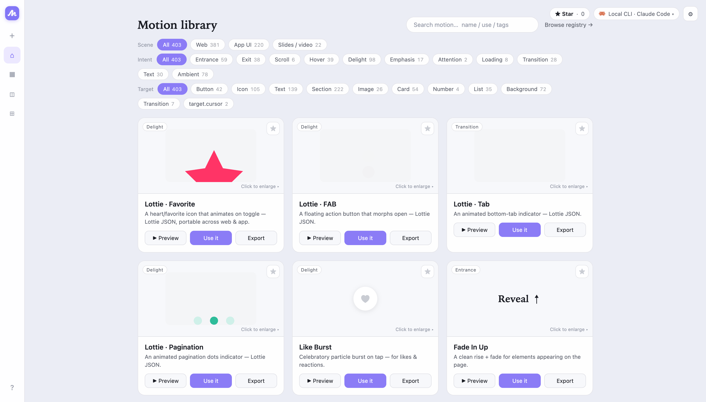<br/>
<sub><b>动效库</b> —— 403 个策展配方带活预览，按意图搜索。每个配方带 <code>avoid_when</code> 和克制预算：品味是强制执行的，不是碰运气的。</sub>
</td>
<td width="50%" valign="top">
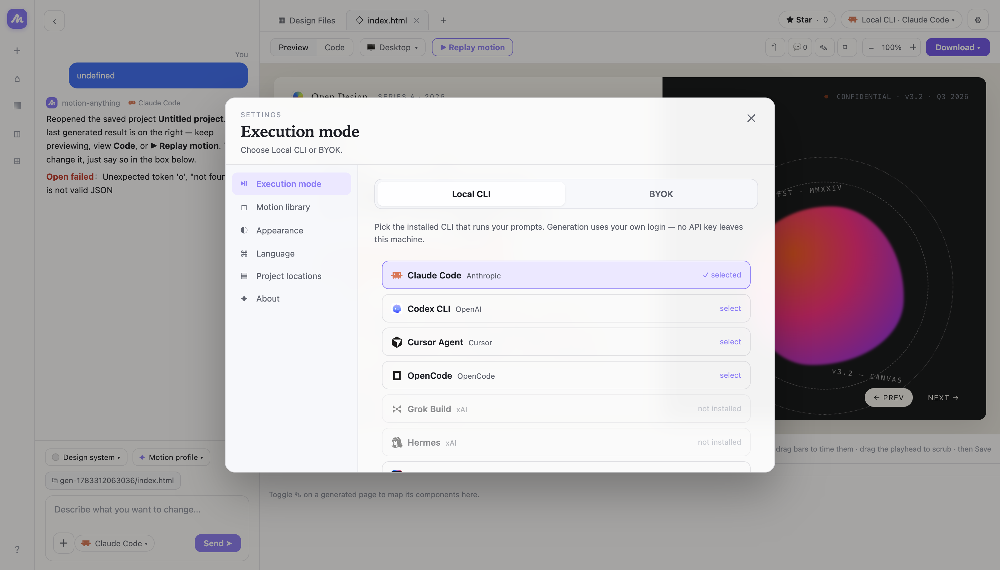<br/>
<sub><b>引擎</b> —— 用你已经在付费的 agent。PATH 上的 8 个 CLI 自动检测，或 BYOK 直连 Anthropic / OpenAI / Google API。key 永远不出你的机器。</sub>
</td>
</tr>
</table>

<table>
<tr>
<td valign="top">
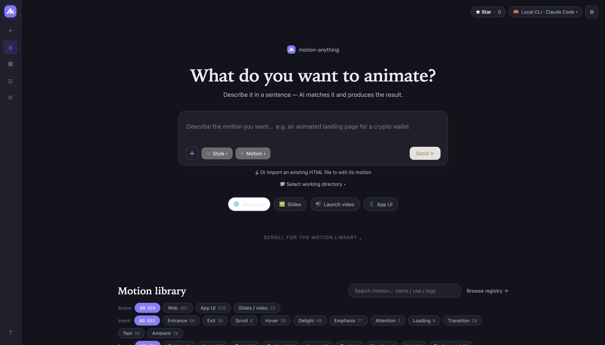<br/>
<sub><b>暗色模式</b> —— 整个应用双主题，system 模式跟随系统。</sub>
</td>
</tr>
</table>

---

## 为什么做 motion-anything

动效是数字工艺里杠杆最高、被理解最少的部分。四个问题把好动效挡在门外：

1. **AI 生成的页面是死的** —— 生成落地页容易，改动效只能重新抽卡或手写 CSS。生成与精修之间有断层。*motion-anything 在跑着的页面上逐组件改动效，改完写回文件。*
2. **AI 没有品味** —— 默认产出要么齐刷刷 fade-in，要么满屏烟花。*在这里品味是功能：每个配方声明 <code>avoid_when</code> 和克制预算，超预算编辑器警告，永远尊重 <code>prefers-reduced-motion</code>，只用 GPU 安全属性。*
3. **生态碎到没法学** —— GSAP、Framer Motion、anime.js、Lottie…… 每套一条学习曲线。*你表达意图（「像液态金属的背景」），路由从策展配方里选。你不需要知道任何库名。*
4. **工具锁定** —— 专有模型、按次收费、水印、只能交接的产物。*这里是 Apache-2.0、本地优先、引擎无关、万物可导出。*

**vs. Figma Motion** —— 它的产物是交接物，我们的产物就是运行中的页面本身；它的时间轴没有交互触发，这里 hover 和 click 是一等公民；它的动效锁在它的应用里，这里导出 JSON / CSS / React / Lottie 或任何 agent 都能用的 skill。

---

## 快速开始

```bash
git clone https://github.com/XingliGe/motion-anything.git
cd motion-anything
node cli/bin/motion.js serve 4399
# 打开 http://localhost:4399
```

安装到此为止。**没有 npm install —— 项目零依赖。** 需要 Node 18+ 和至少一个引擎：PATH 上任意受支持的 CLI（自动检测），或 BYOK 的 API key（设置 → 执行模式）。

---

## 引擎

提示词跑在**你的** agent 上 —— 你已经付费的 CLI 会话，或你自己的 API key。不经过任何人的服务器代理。

| 引擎 | 厂商 | 通道 |
|---|---|---|
| Claude Code | Anthropic | headless `-p` + stream-json |
| Codex CLI | OpenAI | `exec --json` 事件流 |
| Cursor Agent | Cursor | stream-json |
| OpenCode | OpenCode | `run --format json` 事件流 |
| Grok Build | xAI | 纯文本（prompt 文件） |
| Hermes | xAI | ACP（stdio 上的 JSON-RPC） |
| Gemini CLI | Google | 纯文本 |
| Open Design Cloud | nexu.io | ACP（经 `vela` CLI） |
| BYOK | Anthropic / OpenAI / Google | 你的 key 直连 API |

---

## 动效库

- **403 个动效配方** —— 77 个带活预览的真效果 + 策展参考卡。分类：氛围背景、反馈与愉悦、交互、文字、转场。
- **标准化 manifest** —— 每个配方一个文件夹：`recipe.motion.yaml` + 自包含 `preview.html` + 实现 + `SKILL.md`。三个别处没有的字段：`intent_keywords`、`avoid_when`、`restraint`。
- **59 套设计系统品牌包** + **58 个视频模板** + **112 个 HTML 原型模板** + **2680 个图标** —— 生成从品牌级起步，不从空白开始。
- **230 个可移植 skill** —— 任意配方导出为 `SKILL.md`，拖进 <a href="https://github.com/nexu-io/open-design">Open Design</a> 或任何读 skill 的 agent。

品味契约见 [`MOTION-SPEC.md`](MOTION-SPEC.md)，添加配方的黄金路径见 [`AGENTS.md`](AGENTS.md)。

---

## 万物可导出

| 从 | 到 |
|---|---|
| 任意组件的动效 | JSON（可移植）· CSS · React · Lottie |
| 任意动效页面 | MP4（可定格时间轴抓帧）· GIF · 单文件 HTML |
| 任意 launch 视频 | 浏览器内 WebCodecs MP4 —— 无水印、不上传、零费用 |
| 任意配方 | 一个 `SKILL.md`，喂给你的 agent |

---

## 架构

纯文件、无构建、零 npm 依赖 —— 整个应用刻意做到「跑起来很无聊」：

- `app/index.html` —— 完整客户端（工作台、编辑器、库、四语 i18n）在一个文件里。
- `cli/bin/motion.js` —— 服务端 + CLI 在一个文件里：静态服务、项目存储、引擎派发（stream-json / JSONL 事件 / 纯文本 / ACP / BYOK 五种协议一个接口）。
- `app/video/` —— 画布合成器：引擎、WebCodecs MP4 导出、HTML 抓帧、vendored `mp4-muxer` + `gifenc`（MIT）。
- `recipes/` —— 动效库。`recipes/web/_fx/shaderbg.js`（58 行）是所有着色器配方背后的零依赖 WebGL 运行器。
- `skills/` —— 路由 skill + 内置伴生 skill。

agent 是这个代码库的一等公民：[`AGENTS.md`](AGENTS.md) 是任何编码 agent 都能遵循的工作协约，[`PROGRESS.md`](PROGRESS.md) 维护状态。

---

## 路线图

- **v0.1** —— 配方库 + 路由 skill + 工作台 + 视频线 + 8 引擎 + BYOK ← *当前*
- **v0.x** —— 更丰富的视频动效（配方复用进视频）、更深的 Figma 导入、流式 BYOK
- **v1** —— 给已有 Open Design 产物自动加动效；设计组件 → 动效自动分配

---

## 许可与致谢

[Apache-2.0](LICENSE)。[nexu.io](https://github.com/nexu-io) · Open Design 家族项目。
第三方来源与授权记录在 [`ATTRIBUTION.md`](ATTRIBUTION.md)。
